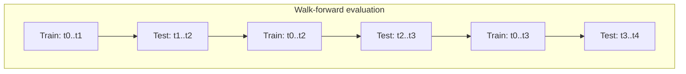

# Requirements for Market Price Prediction in Stocks and Cryptocurrencies

## Executive summary

Building market price prediction capability is less about “picking the perfect model” and more about assembling a coherent system: clearly defined prediction targets; legally obtained, high-integrity, time-aligned data; leakage-resistant feature engineering; rigorous evaluation and backtesting with realistic costs; and deployment+monitoring designed for non-stationary markets. The painful truth is that most failures come from data and evaluation mistakes (timestamp misalignment, survivorship/look-ahead bias, corporate action mishandling, unrealistic fills), not from whether you used a Transformer or a tree model. citeturn4search2turn7search0turn5search2turn13search0turn13search3

Stocks and crypto differ materially in market structure and available signals. Equities have corporate actions (splits/dividends) that must be handled correctly, and professional-grade market data often comes with licensing and redistribution constraints. citeturn5search2turn6search2turn6search14turn6search6 Crypto trades 24/7 on fragmented venues; order books and funding/derivatives dynamics can dominate short-horizon behavior; and additional “fundamental-ish” signals may come from on-chain activity (blocks/transactions/logs) and exchange flows. citeturn6search5turn9search20turn1search19turn11search3

A rigorous implementation usually converges on an architecture with (1) ingestion of market + auxiliary data (REST/WebSocket, batch + streaming), (2) immutable raw storage + cleaned canonical layers, (3) point-in-time feature views and training datasets, (4) walk-forward evaluation with embargo/purging where appropriate, (5) strategy simulation with transaction costs and market impact, and (6) production monitoring for drift and performance decay with scheduled and event-triggered retraining. citeturn7search0turn4search2turn14search7turn17search1turn17search2

## Problem framing and prediction targets

Market “price prediction” can mean at least four different tasks; you should pick one explicitly because it determines labels, features, and evaluation:

**Level prediction (regression).** Predict next price or expected return over horizon \(h\): \(r_{t,t+h}\) or \(\log P_{t+h} - \log P_t\). This is common, but pure price levels are often poorly behaved statistically; returns are generally more stationary than prices. citeturn13search3turn4search0

**Direction prediction (classification).** Predict sign of return: \( \mathbb{1}[r_{t,t+h} > 0]\). Directional accuracy can be profitable only if it exceeds costs and aligns with risk constraints; “51% accuracy” is not automatically money. citeturn12search2turn4search2turn13search0

**Volatility / risk forecasting.** Predict conditional variance, VaR/ES inputs, or realized volatility (useful for sizing and risk management even if mean-return prediction is weak). Volatility clustering is a well-documented stylized fact and is often more predictable than returns. citeturn13search3turn4search1turn4search5

**Distributional / quantile forecasting.** Predict quantiles (e.g., 5th/95th percentile of returns) or full predictive distributions for risk-aware trading decisions and position sizing. This is often a better match to fat tails and regime shifts than point forecasts. citeturn13search3turn12search3

Two realities should be built into the design from day one:

1) **Market efficiency is a moving target.** The efficient markets literature argues prices “fully reflect” information in various forms, which limits easy alpha; predictability tends to be weak, unstable, and capacity-constrained. citeturn13search0 The adaptive markets view reframes efficiency as regime-dependent and evolving with competition and structure—useful as a mental model for why models decay. citeturn13search5

2) **Returns are non-Gaussian and non-IID.** Heavy tails, volatility clustering, and changing dependence patterns mean standard “IID train/test” assumptions fail more often than they succeed. citeturn13search3turn4search2

```mermaid
flowchart LR
  A[Define target\n(horizon, instrument universe,\ntradable signal type)] --> B[Define decision\n(buy/sell/hold, sizing,\nrisk constraints)]
  B --> C[Choose evaluation lens\n(error metrics + trading metrics)]
  C --> D[Data & features\nbuilt to match target\nand decision]
  D --> E[Modeling\n+ backtesting\n+ deployment]
```

## Data requirements and sources

A robust predictor is usually multi-modal: market microstructure + reference data + fundamentals/macros + text/sentiment + (for crypto) on-chain. Each source class has different latency, licensing, and “truthiness.”

### Market data modalities

**Trades and candles (OHLCV).**  
For short horizons you often need trades/quotes; for longer horizons, candles may be enough. Crypto exchanges commonly provide both WebSocket streams and REST endpoints for market data (including candlesticks/klines). citeturn0search1turn0search17turn9search4turn0search6

**Order books (Level 2 / depth).**  
Order book features (spread, depth, imbalance, order flow) can be predictive at very short horizons but are noisy and expensive to process. Exchanges provide instructions for maintaining a correct local book from snapshots + incremental updates; if you get sequencing wrong, your features are fantasy. citeturn0search13turn9search0turn9search8

**Reference / instrument metadata.**  
Tick size, lot size, trading hours/halts (equities), contract specs (futures/perps), symbol mapping, and venue identifiers matter for data joins and realistic execution modeling. Exchange APIs commonly expose rate limits and constraints that shape ingestion design. citeturn6search3turn10search11

### Data sources you can realistically use

#### Exchange and venue APIs (market microstructure)

- **entity["company","Binance","crypto exchange"]** provides detailed WebSocket market streams (including depth and kline/candlestick updates) and documents how to correctly maintain local books from snapshot + diff streams. citeturn0search1turn0search13turn0search17turn6search3  
- **entity["company","Coinbase","crypto exchange"]** offers REST + WebSocket market data feeds via its Advanced Trade APIs. citeturn0search2turn0search6turn0search14  
- **entity["company","Kraken","crypto exchange"]** documents WebSocket market data feeds and explicitly explains how to maintain a valid order book locally. citeturn9search0turn9search8turn9search4  
- For equities, some venues publish free historical datasets (often delayed or limited). **entity["organization","IEX Exchange","stock exchange us"]** provides historical download access (T+1) under terms of use. citeturn10search11

**Crypto venue fragmentation is not optional to acknowledge.** Liquidity is spread across multiple venues with differing fees, margining, and risk controls; prices can diverge and arbitrage connects them imperfectly. citeturn6search5turn6search9

image_group{"layout":"carousel","aspect_ratio":"16:9","query":["order book depth chart example","candlestick chart OHLCV example","blockchain explorer transaction details example","news sentiment analysis dashboard example"],"num_per_query":1}

#### Fundamentals and corporate disclosures (mainly equities)

For stocks, “fundamentals” typically means financial statements, corporate actions, and point-in-time filings. The **entity["organization","U.S. Securities and Exchange Commission","us regulator"]** provides EDGAR-derived data via APIs on data.sec.gov, including submissions and extracted XBRL, and sets fair-access expectations for automated retrieval. citeturn0search0turn0search4turn15search3turn15search6

To avoid look-ahead bias, fundamentals must be **as-known-at-the-time** (filing timestamp, publication lag, restatements). “Latest fundamentals joined to past prices” is a classic self-own. citeturn19search1turn7search0

#### On-chain data and blockchain-derived metrics (mainly crypto)

You can source on-chain signals in three main ways:

- Run your own node interface / RPC for canonical chain data and logs (e.g., JSON-RPC methods for EVM chains; transaction/block RPCs for Bitcoin-family nodes). citeturn1search2turn1search19turn1search11  
- Use explorers and hosted APIs like **entity["company","Etherscan","ethereum block explorer"]** (e.g., event logs endpoints). citeturn11search0turn11search4  
- Use commercial/warehouse-style providers like **entity["company","Coin Metrics","crypto data provider"]** (API access to structured crypto market and network data) or analytics platforms like **entity["company","Dune","onchain analytics platform"]** (execute queries and retrieve results programmatically). citeturn11search3turn11search2turn11search10

Some sources also provide chain-level statistics and exchange-rate/market feeds (e.g., **entity["company","Blockchain.com","crypto services company"]** APIs and charts). citeturn11search1turn11search17

#### News and social signals (both markets)

News and social data can help around events and regime shifts, but they introduce licensing constraints, rate limits, and “data rights” landmines.

- **entity["organization","GDELT Project","news events database"]** offers structured global event/news data and APIs (updates frequently, long historical span). citeturn2search0turn2search16  
- **entity["organization","NewsAPI","news api service"]** exposes endpoints for article search and retrieval with parameters useful for downstream NLP pipelines. citeturn2search5turn2search1  
- Social platforms impose explicit terms and rate limits: **entity["organization","Reddit","social platform"]** defines developer/data API terms, and **entity["company","X","social platform"]** documents endpoint access and rate limiting (and, in practice, policy constraints can affect permissible ML uses). citeturn3search2turn3search6turn2search3turn3search0

#### Macroeconomic indicators (mostly equities, but also crypto via risk-on/risk-off)

Two widely used primary sources with APIs:

- **entity["organization","Federal Reserve Bank of St. Louis","fed reserve bank st louis"]** provides the FRED API for programmatic access to macro and financial time series. citeturn1search0turn1search4  
- **entity["organization","World Bank","development bank"]** offers the Indicators API with broad global coverage and long series histories. citeturn1search1turn1search21

### Data source comparison table

| Source class | What you get | Strengths | Failure modes / gotchas |
|---|---|---|---|
| Exchange REST (trades/candles) | Historical bars/trades; snapshots | Simple ingestion; replayable | Rate limits; symbol changes; missing trades; venue bias citeturn6search3turn6search7 |
| Exchange WebSockets (L1/L2/trades) | Streaming updates | Low latency; rich microstructure | Order book sequencing bugs; reconnect gaps; backfill complexity citeturn0search13turn9search0turn0search6 |
| Regulatory filings/XBRL | Fundamentals, disclosures | Point-in-time fundamentals; auditable | Reporting lag; restatements; mapping issuers to tickers citeturn0search4turn15search6turn5search3 |
| On-chain RPC/explorer APIs | Blocks, txs, event logs | Crypto-native signals; transparent ledger | Reorgs/finality; address attribution; expensive joining citeturn1search19turn11search0turn11search4 |
| News APIs / event DBs | Articles, event metadata | Regime/event sensitivity | Licensing; topic leakage; latency/coverage bias citeturn2search5turn2search0 |
| Social APIs | Posts, engagement | Crowd attention proxy | Rate limits; policy restrictions; bot noise citeturn2search3turn3search2turn3search0 |
| Macro APIs | Rates, CPI, labor, etc. | Interpretable drivers | Low frequency; revision history; alignment to trading calendar citeturn1search0turn1search1 |

## Data quality, preprocessing, and schemas

### Data quality and preprocessing checklist

**Timestamp hygiene (non-negotiable).**  
Normalize everything to UTC, preserve original exchange timestamps, and explicitly track event time vs ingestion time. For streaming, you need durable offset tracking, replay, and backfill to handle disconnects and late arrivals. citeturn9search3turn17search2

**Cleaning and deduplication.**  
Typical issues: duplicated trades after reconnect, out-of-order updates, negative/zero sizes due to parsing bugs, and “gap candles” when resampling sparse markets. Exchanges themselves warn you to use snapshots + buffered events to build correct books; treat that as a requirement, not a suggestion. citeturn0search13turn9search0

**Resampling (ticks → bars) with microstructure awareness.**  
At high frequency, observed trade prices can deviate from the “efficient price” because of bid–ask bounce, tick grid effects, and other microstructure noise; sampling choices can create artificial autocorrelation and distort realized volatility. citeturn19search15turn19search19

**Missing data handling.**  
Market closures (equities), outages (any venue), and illiquidity create structured missingness. Your imputation policy must be feature-specific: forward-fill for slowly varying macro data may be ok; forward-filling order book depth is usually a lie. citeturn7search0turn19search1

**Corporate actions (equities): splits/dividends adjustments.**  
Equity historical prices often need adjustment so returns are comparable across splits and dividend distributions. Data vendors define “adjusted close” as close price adjusted for splits and dividends (often using CRSP-style multipliers). citeturn5search2turn5search0turn5search7 Mis-handling this is one of the fastest ways to build a model that “predicts” corporate actions instead of returns. citeturn5search2turn19search1

**Survivorship and look-ahead bias controls.**  
Backtests that only include surviving assets, or that join future-revised fundamentals into the past, routinely overstate performance. Definitions and practical examples of look-ahead bias emphasize the use of only information available at the simulated decision time. citeturn19search1turn19search20turn4search2

### Sample schemas (practical starting point)

Below are “minimum viable” canonical tables/views that support both research and production. Use immutable raw tables plus derived cleaned tables.

```sql
-- Instruments / reference (point-in-time where needed)
CREATE TABLE instrument_master (
  instrument_id        BIGINT PRIMARY KEY,
  symbol               TEXT,
  asset_class          TEXT,      -- equity, crypto_spot, perp, future, etc.
  venue                TEXT,      -- exchange/venue code
  base_asset           TEXT,
  quote_asset          TEXT,
  tick_size            NUMERIC,
  lot_size             NUMERIC,
  currency             TEXT,
  timezone             TEXT,
  start_ts_utc         TIMESTAMPTZ,
  end_ts_utc           TIMESTAMPTZ,
  metadata_json        JSONB
);

-- Trades (append-only)
CREATE TABLE trades (
  instrument_id        BIGINT,
  venue                TEXT,
  trade_id             TEXT,
  price                NUMERIC,
  size                 NUMERIC,
  side                 TEXT,       -- buy/sell if available
  event_ts_utc         TIMESTAMPTZ, -- exchange timestamp
  ingest_ts_utc        TIMESTAMPTZ, -- your system timestamp
  PRIMARY KEY (venue, trade_id)
);

-- Candles (derived from trades or vendor bars)
CREATE TABLE candles_1m (
  instrument_id        BIGINT,
  venue                TEXT,
  bar_start_ts_utc     TIMESTAMPTZ,
  open                 NUMERIC,
  high                 NUMERIC,
  low                  NUMERIC,
  close                NUMERIC,
  volume               NUMERIC,
  vwap                 NUMERIC,
  trades_count         INTEGER,
  source               TEXT,        -- 'derived' or vendor code
  PRIMARY KEY (instrument_id, venue, bar_start_ts_utc)
);

-- L2 order book snapshots and incremental updates (store both)
CREATE TABLE l2_book_snapshots (
  instrument_id        BIGINT,
  venue                TEXT,
  snapshot_ts_utc      TIMESTAMPTZ,
  last_update_id       BIGINT,
  bids_json            JSONB,  -- [{price, size}, ...] best->worse
  asks_json            JSONB,
  PRIMARY KEY (instrument_id, venue, snapshot_ts_utc)
);

CREATE TABLE l2_book_deltas (
  instrument_id        BIGINT,
  venue                TEXT,
  event_ts_utc         TIMESTAMPTZ,
  first_update_id      BIGINT,
  last_update_id       BIGINT,
  side                 TEXT,   -- bid/ask
  price                NUMERIC,
  size                 NUMERIC,
  ingest_ts_utc        TIMESTAMPTZ
);

-- Fundamentals / filings (point-in-time)
CREATE TABLE fundamentals_pti (
  issuer_id            TEXT,        -- e.g., CIK mapping, internal issuer key
  report_period_end    DATE,
  filing_ts_utc        TIMESTAMPTZ,   -- when it became public
  metric_name          TEXT,          -- revenue, eps, etc.
  metric_value         NUMERIC,
  units                TEXT,
  source_doc_id        TEXT,
  PRIMARY KEY (issuer_id, report_period_end, filing_ts_utc, metric_name)
);

-- News / social documents (store raw + derived features)
CREATE TABLE documents (
  doc_id               TEXT PRIMARY KEY,
  source               TEXT,          -- news, social
  published_ts_utc     TIMESTAMPTZ,
  retrieved_ts_utc     TIMESTAMPTZ,
  language             TEXT,
  title                TEXT,
  body                 TEXT,
  entities_json        JSONB,         -- extracted entities/tickers
  url_hash             TEXT
);

CREATE TABLE doc_sentiment (
  doc_id               TEXT PRIMARY KEY,
  model_version        TEXT,
  sentiment_score      NUMERIC,       -- [-1, 1] or [0, 1]
  sentiment_conf       NUMERIC,
  topic_json           JSONB
);

-- Macro series (keep release + revision timestamps if available)
CREATE TABLE macro_series (
  series_id            TEXT,
  obs_date             DATE,
  value                NUMERIC,
  vintage_ts_utc       TIMESTAMPTZ,    -- as-of / revision time
  source               TEXT,
  PRIMARY KEY (series_id, obs_date, vintage_ts_utc)
);
```

These schemas reflect two core “rigor knobs”:

1) **Store event time and ingest time** to diagnose latency and late data. citeturn9search3turn17search2  
2) **Make time-of-availability explicit** (filing timestamps, macro vintages) to avoid look-ahead bias. citeturn19search1turn0search4

## Feature engineering blueprint

Feature engineering should mirror market microstructure and the decision horizon. A clean way to organize features is by “information layer,” from fast/technical to slow/fundamental.

### Technical and time-series features (price/volume)

A typical baseline feature set includes:

- Returns: \(r_{t}\), \(r_{t:t-k}\), log returns, realized volatility proxies. citeturn13search3  
- Moving averages / momentum / trend: SMA/EMA, MACD-style differences, slope of rolling regressions. citeturn7search7  
- Oscillators: RSI, stochastic indicators, etc., often computed via established libraries for consistency. citeturn7search7turn7search15  
- Volume features: volume change, volume imbalance (if buy/sell classification exists), VWAP deviations.

Caution: many indicators are transformations of the same information and can create collinearity; tree models handle this better than linear ones, but leakage and overfitting remain the real threat. citeturn4search2turn7search2

### Order book and microstructure features (mostly short horizon)

Common L2-derived features:

- **Spread** (best ask − best bid), **mid price**, **microprice** (mid weighted by depth).  
- **Depth** at top N levels; **order book imbalance** (bid depth vs ask depth).  
- **Order flow** statistics: count/size of updates, cancellations vs additions, short-term pressure proxies.  
- **Liquidity/impact proxies**: Kyle-style lambda approximations, realized spread estimates (advanced).

Because accurate L2 features depend on a correctly reconstructed order book, your feature pipeline should encode and validate sequencing rules from venue documentation (snapshot + delta update IDs, discard out-of-range events). citeturn0search13turn9search0turn9search8

### Sentiment and event features (news/social)

A practical approach is **document → entity linking → time-bucket aggregation**, e.g., aggregate sentiment to 5m/1h/1d by instrument.

- News coverage volume, novelty (first mention), source credibility tiers. citeturn2search5turn2search1  
- Sentiment score (possibly model ensemble), emotion/uncertainty markers, topic probabilities.  
- Event flags: earnings, product launches, regulatory actions, macro releases, chain incidents (for crypto).

Using event databases and news APIs can bootstrap this layer; GDELT explicitly structures event categories and is updated frequently, suitable for building event-count and tone-like proxies. citeturn2search0turn2search16

### On-chain features (crypto)

On-chain metrics are easiest to think of as “network activity + flow + cost of blockspace”:

- Activity: tx count, active addresses, new addresses (attribution caveats). citeturn11search9turn11search3  
- Fees / congestion: average fees, gas usage (chain-specific). citeturn1search19  
- Contract event signals: token transfers, DEX swaps, liquidation events via logs. APIs provide log retrieval (e.g., event logs endpoints) that you can map to instrument-level features. citeturn11search0turn11search4  
- Higher-level aggregations: exchange inflow/outflow proxies (requires labeling), stablecoin supply changes (provider-dependent). citeturn11search3

### Macro and cross-asset features

For equities (and increasingly for crypto in risk-on regimes), include:

- Rates/curve proxies, inflation, employment, dollar indices, commodity proxies—often sourced as time series via macro APIs. citeturn1search0turn1search1  
- Cross-asset signals: equity index returns, volatility index proxies, correlations/rolling betas.

### Feature list template (copy/paste for a project spec)

| Feature group | Examples | Best for horizons | Pitfalls |
|---|---|---|---|
| Price/return | lagged returns, rolling vol, momentum | minutes→months | non-stationarity; regime shifts citeturn13search3 |
| Technical indicators | RSI, MACD, Bollinger Bands | minutes→weeks | redundant transforms; data snooping citeturn7search7turn4search2 |
| Order book | spread, imbalance, depth, order flow | milliseconds→minutes | book reconstruction errors; microstructure noise citeturn0search13turn19search15 |
| Fundamentals | earnings, leverage, cash flow | days→quarters | filing lag; restatements; point-in-time joins citeturn0search4turn19search1 |
| News/social | sentiment, mention volume, event flags | minutes→days | licensing; bot noise; topic leakage citeturn3search0turn3search2turn2search5 |
| On-chain | tx count, logs-derived events | minutes→days | attribution uncertainty; reorg/finality concerns citeturn1search19turn11search0 |
| Macro | rates, CPI, labor | days→months | revisions and vintage alignment citeturn1search0turn1search4 |

## Modeling approaches and selection

A disciplined model selection process starts with baselines and explicit assumptions about what is predictable at your horizon.

### Model families (with practical guidance)

**Statistical time series models (ARIMA/SARIMA, ARIMAX).**  
Useful as transparent baselines for mean dynamics and seasonality, and as components in hybrids. Statsmodels’ ARIMA interface supports ARIMA/SARIMA/SARIMAX forms, including exogenous regressors. citeturn4search0turn4search4  
Best when: you have low-dimensional signals, longer horizons, and want interpretability.

**Volatility models (ARCH/GARCH family).**  
Often strong for volatility/risk forecasting; the `arch` library documents common GARCH specifications and forecasting methods (analytical/simulation/bootstrap). citeturn4search1turn4search5turn4search14  
Best when: the objective is volatility and risk-aware sizing, not point price levels.

**Tree-based ML (random forests, gradient boosting like XGBoost/LightGBM).**  
Strong default for tabular engineered features (technical + macro + sentiment aggregates). LightGBM explicitly targets efficiency and supports parallel/distributed and GPU learning. citeturn7search2turn7search10turn7search6 XGBoost provides flexible objectives and regularization controls. citeturn7search1  
Best when: you have many heterogeneous features and want strong out-of-the-box performance with reasonable tuning cost.

**SVMs and linear models.**  
Can work with careful feature scaling and when the signal is weak but stable; often used as baselines rather than final production models in noisy markets.

**Neural networks (RNN/LSTM, Transformers).**  
LSTMs were designed to learn long-term dependencies in sequences. citeturn8search0 Transformers scale well and rely on self-attention rather than recurrence. citeturn8search1 For multi-horizon forecasting with mixed covariates, specialized architectures like Temporal Fusion Transformer exist. citeturn8search2  
Best when: you have large datasets, stable data pipelines, and you can afford careful backtesting to prevent overfitting and leakage.

**Hybrid and ensemble models.**  
Common hybrid patterns include:
- Mean model (tree/NN) + volatility model (GARCH) for risk-aware decisions. citeturn4search1turn4search0  
- Stacked ensembles combining linear + tree + NN to reduce model-specific failure modes, at the cost of complexity and easier backtest overfitting. citeturn4search2

### Model comparison table

| Model family | Typical target | Pros | Cons | Compute profile |
|---|---|---|---|---|
| ARIMA/SARIMAX | mean return; level baseline | interpretable; strong baseline citeturn4search0 | limited nonlinear modeling; fragile under regime shifts citeturn13search3 | CPU; fast |
| GARCH/EGARCH | volatility / risk | models clustering well citeturn4search1 | not a full return predictor; distributional assumptions matter citeturn13search3 | CPU; moderate |
| Gradient boosting (LightGBM/XGBoost) | returns/direction | strong on tabular features; handles missingness; scalable citeturn7search2turn7search1 | can overfit via feature mining/backtest leakage citeturn4search2 | CPU; optional GPU citeturn7search2 |
| LSTM | sequence forecasting | learns temporal patterns citeturn8search0 | data-hungry; tuning sensitivity; leakage risks | GPU helpful |
| Transformer/TFT | multi-horizon with covariates | scalable; handles long dependencies citeturn8search1turn8search2 | heavy compute; easy to overfit; harder interpretability without care | GPU/ multi-GPU citeturn8search11 |

### Model selection checklist (rigorous, not romantic)

Use this as a gating checklist before you let any model into backtesting:

- Target is defined (horizon, label, decision rule) and matches your trading constraints. citeturn7search0turn12search2  
- Data is point-in-time (fundamentals/news availability timestamps and universe membership are time-correct). citeturn19search1turn19search20  
- Backtest split scheme prevents leakage (walk-forward, time-series CV; consider purging/embargo when labels overlap future windows). citeturn7search0turn4search2  
- Transaction costs, spread, and market impact assumptions are specified (even conservative placeholders beat pretending they’re zero). citeturn12search2  
- Multiple evaluation lenses are used (forecast error + directional metrics + portfolio metrics + drawdowns). citeturn12search0turn12search3turn4search2

### Hyperparameter tuning strategies (and when to stop)

**Start simple:** small manual sweeps around a baseline model to sanity-check signal existence. Then scale.

- Grid search is exhaustive over a parameter grid (useful for small discrete spaces). citeturn18search1  
- Randomized search samples parameter settings efficiently when the space is large. citeturn18search2  
- Bayesian/TPE-style optimization (e.g., Optuna’s TPE sampler) can be more sample-efficient, especially when training is expensive. citeturn18search0turn18search4  
- Distributed tuning frameworks (e.g., Ray Tune) scale sweeps to clusters when you have real compute and real patience. citeturn18search7turn18search3

**Critical guardrail:** every extra tuning run increases the chance you are selecting noise (“backtest overfitting”), so you need strict separation of tuning and final evaluation and/or techniques that explicitly estimate overfitting probability. citeturn4search2turn4search15

### Typical compute requirements (rule-of-thumb)

Compute depends more on data volume and feature complexity than on whether the asset is a stock or a coin.

- Tree-based models: usually CPU-friendly; LightGBM also supports GPU and distributed training if you need it. citeturn7search2  
- Deep learning: GPUs are typically required for practical iteration; PyTorch documents multi-GPU scaling via DistributedDataParallel for large workloads. citeturn8search11turn8search3  
- Order book pipelines: often the bottleneck is streaming + storage bandwidth rather than model training. citeturn9search3turn0search13

## Evaluation, backtesting, and risk integration

### Leakage-resistant evaluation design

**Walk-forward (rolling or expanding window) evaluation** is the default for time-ordered data; scikit-learn’s `TimeSeriesSplit` explicitly exists because standard CV would train on future data and test on past data. citeturn7search0

If your labels depend on future windows (e.g., “max return in next N bars,” stop-loss/TP outcomes), you can leak information through overlapping intervals. That’s why finance ML literature emphasizes purging/embargo concepts to prevent overlap leakage, and why backtest overfitting diagnostics are a first-class requirement. citeturn4search2turn4search10turn4search15



### Metrics: forecast accuracy and trading viability

You need two metric families:

**Forecast metrics (statistical).**
- RMSE / MAE for regression.  
- MAPE is common but can be ill-behaved near zero and is often less meaningful for returns.  
- Directional accuracy / F1 / AUC for classification.

**Trading metrics (economic reality).**
- Sharpe ratio (reward-to-variability) is widely used for risk-adjusted performance evaluation. citeturn12search0  
- Maximum drawdown measures worst peak-to-trough decline and is essential for understanding tail pain. citeturn12search3  
- Turnover, hit rate vs payoff ratio, exposure, skew/kurtosis, and tail risk metrics.

Backtest overfitting work explicitly warns that high backtest performance is easy to obtain after trying enough configurations; you must treat the tuning process itself as a source of selection bias. citeturn4search2turn4search15

### Costs, slippage, and execution latency

A predictor that ignores tradeability is not a predictor—it’s a short story.

**Transaction costs and market impact.**  
Execution models like the classic optimal execution framework explicitly incorporate temporary and permanent market impact and the trade-off between speed and cost. citeturn12search2 Even if you don’t implement a full execution optimizer, you should model:
- fees/commissions,
- bid–ask spread,
- slippage (function of volatility and order size),
- fill uncertainty/partial fills,
- latency and order queue effects (especially with L2 signals).

Backtesting engines often advertise support for slippage, transaction costs, and realistic event-driven simulation; but correctness depends on your assumptions and data granularity. citeturn14search13turn14search0

### Risk management and strategy integration

A practical integration is:

1) **Signal → expected return / probability distribution**  
2) **Sizing → risk budget allocation** (volatility targeting, capped leverage, position limits)  
3) **Risk controls → stops, max leverage, concentration, drawdown limits**  
4) **Execution → orders optimized for cost vs urgency** citeturn12search2turn12search3

If you use log-optimal (Kelly-style) sizing, do it with heavy constraints; the original information-rate framing implies aggressive sizing under idealized assumptions that markets absolutely do not honor. citeturn12search1turn13search3

## Infrastructure, deployment, monitoring, and compliance

### Reference architecture and tooling

A production-grade system usually includes:

**Ingestion and streaming.**  
Use REST for backfills and WebSockets for live feeds (market data). For durable streaming and fan-out to multiple consumers (feature builders, archivers, trading engine), event-streaming platforms like **entity["organization","Apache Kafka","event streaming platform"]** are a common backbone. citeturn9search3turn9search7

**Storage.**  
Use immutable raw storage plus columnar analytics formats. **entity["organization","Apache Parquet","columnar file format"]** is designed for efficient columnar storage and retrieval and is widely used in analytics pipelines. citeturn10search9turn10search3

**Backtesting and research.**  
Frameworks like backtrader, Zipline derivatives, and vectorized engines offer different trade-offs (event-driven realism vs fast vectorized sweeps). citeturn14search0turn14search5turn14search2

**Experiment tracking and model registry.**  
A registry avoids “which model is in prod?” chaos. **entity["organization","MLflow","ml ops platform"]** provides model registry workflows and lifecycle management concepts. citeturn14search7turn14search3

**Monitoring, alerting, and drift detection.**  
Operational monitoring typically uses **entity["organization","Prometheus","monitoring system"]** for metrics + alert rules and **entity["company","Grafana","observability platform"]** for dashboards. citeturn17search2turn17search10  
For ML drift and concept drift detection, libraries like River provide drift detectors (e.g., ADWIN, Page-Hinkley, EDDM) and monitoring toolkits can compute drift metrics between reference and live distributions. citeturn17search3turn17search0turn17search1

```mermaid
flowchart LR
  A[Market + alt data\nREST/WebSocket/APIs] --> B[Stream bus\n+ batch backfill]
  B --> C[Raw immutable store]
  C --> D[Clean canonical layer\n(resample, adjust, validate)]
  D --> E[Feature views\n(point-in-time)]
  E --> F[Train + tune\n(walk-forward)]
  F --> G[Backtest + costs\n+ risk limits]
  G --> H[Deploy model\n+ strategy config]
  H --> I[Monitor\n(perf + drift + data health)]
  I --> E
```

### Deployment and monitoring practices

**Retraining cadence:** schedule-based (daily/weekly) plus event-based retraining triggers when drift detectors fire or performance degrades beyond tolerance. Drift detectors are explicitly designed to raise alarms when data distributions change. citeturn17search3turn17search0

**Model monitoring:** monitor prediction distributions, feature drift, latency, missingness, and downstream portfolio metrics. Prometheus-style alerting patterns separate alert generation from routing/notification. citeturn17search2

**A/B testing for trading:** in finance, classic A/B is constrained by market impact and non-repeatability. Common safer patterns are:
- shadow mode (predict but do not trade),
- paper trading with identical execution logic,
- small capital allocation “canary” rollouts with tight risk caps.  
This is an inference from standard deployment risk management practices; the key is that production feedback loops must be controlled to avoid confusing market randomness with model quality. citeturn4search2turn13search3

### Legal, ethical, and compliance considerations

This is not optional paperwork; it shapes what data you can use and how you can store and redistribute it.

**Market data licensing and redistribution.**  
Equity market data frequently comes with licensing fees and redistribution restrictions; exchanges publish pricing and policies for proprietary data products. citeturn6search2turn6search14turn6search6 If you intend to redistribute data internally across teams or externally, treat licensing as a first-order architectural constraint (what can be cached, for how long, and who can access it). citeturn6search2turn6search6

**Fair access and rate limits for regulatory data.**  
The SEC explicitly enforces fair-access controls for automated retrieval (including rate thresholds) and requires identification via user-agent headers for automated access. citeturn15search2turn15search6turn15search3

**Social/news data terms.**  
Platform terms and policies govern permissible use, retention, and derivative works; rate limits are explicit. citeturn3search2turn2search3turn3search0 Treat “I found it on the internet” as legally meaningless—because it is.

**EU compliance context (high-level).**  
- The **entity["organization","European Union","regional bloc europe"]** General Data Protection Regulation (GDPR) governs processing of personal data; if you store user-level social data, you inherit GDPR obligations (lawful basis, minimization, retention discipline). citeturn15search0turn15search4  
- The EU Market Abuse Regulation (MAR) is the core framework on market abuse/insider dealing for EU financial markets—relevant if you trade equities or related instruments in the EU. citeturn15search1turn15search5  
- For crypto services in the EU, MiCA applies in stages (general application from 30 December 2024; certain token rules from 30 June 2024) and implementation guidance continues to evolve via regulators. citeturn16search11turn16search7turn16search3

Regulatory timelines and national transitions differ in practice; for example, reporting around national licensing transition deadlines in 2026 highlights real operational cutovers that can affect venue access and product availability. citeturn16news48turn0search11

### Limitations and uncertainty you must design for

**Non-stationarity and regime shifts:** Models decay because market structure and participant behavior evolve; adaptive framing helps but does not eliminate the problem. citeturn13search5turn13search3

**Heavy tails and rare events:** Forecast error distributions are not well-behaved; drawdowns and tail risk matter as much as average error. citeturn13search3turn12search3

**Microstructure noise at high frequency:** The “more granular data is always better” belief fails when noise dominates signal; you must validate sampling and feature construction choices. citeturn19search15turn19search19

**Backtest overfitting:** If you try enough features/models/configurations, you will find something that looks great in-sample; frameworks exist specifically to quantify the probability that a backtest is overfit. citeturn4search2turn4search15

**Crypto venue fragmentation and concentration risks:** Fragmentation complicates “true price” definitions; concentration in major venues raises operational and systemic risk (outages, policy shocks). citeturn6search5turn6news40